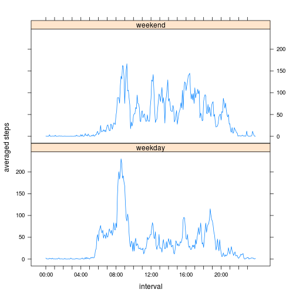

# Reproducible Research: Peer Assessment 1


## Loading and preprocessing the data

**1. Load the data (i.e. read.csv())**

Load activity monitoring data "activity.zip" in the current directory.
This data is downloaded from
https://d396qusza40orc.cloudfront.net/exdata%2Fdata%2FNEI_data.zip


```r
df <- read.csv(unz('activity.zip', 'activity.csv'), colClasses="character")
```

## What is mean total number of steps taken per day?

**1. Make a histogram of the total number of steps taken each day**

I ignore the missing values in the dataset here.  
This code shows a histogram of the total number of steps taken each day.


```r
library(plyr)
daySteps <- subset(df, df$steps != "NA")
daySteps$steps <- as.numeric(daySteps$steps)
daySteps <- ddply(daySteps, .(date), summarize, steps=sum(steps))
breaks <- seq(0,22000,2000)
hist(daySteps$steps, main="Histogram of the total steps per each day", xlab="steps", breaks=breaks)
```

 

**2. Calculate and report the mean and median total number of steps
  taken per day**

These are the mean and median of the total number of steps taken per day.


```r
mean1   <- mean(daySteps$steps)
median1 <- median(daySteps$steps)
cat(sprintf("mean: %f, median: %f", mean1, median1))
```

```
## mean: 10766.188679, median: 10765.000000
```

## What is the average daily activity pattern?

**1. Make a time series plot (i.e. type = "l") of the 5-minute
interval (x-axis) and the average number of steps taken, averaged
across all days (y-axis)**

This code shows a time series plot of the 5-minute interval (x-axis)
and the average number of steps taken, averaged across all days
(y-axis).


```r
timeSteps <- subset(df, df$steps != "NA")
timeSteps$steps <- as.numeric(timeSteps$steps)
interval <- as.numeric(timeSteps$interval)
timeSteps$interval <- (interval %/% 100) * 60 + (interval %% 100)

timeSteps <- ddply(timeSteps, .(interval), summarize, steps=mean(steps))
plot(timeSteps$interval, timeSteps$steps, main="avarage number of steps", 
     xlab="5-minute interval", ylab="averaged steps", type="l", xaxt="n")
axis(side=1, at=seq(0, 23)*60, labels=sprintf("%02d:00", rep(0:23)))
```

 

**2. Which 5-minute interval, on average across all the days in the
dataset, contains the maximum number of steps?**

This is the 5-minute interval which contains the maximum number of
steps on average across all the days in the dataset.


```r
i <- which.max(timeSteps$steps)
sprintf("%02d:%02d", ((i-1)*5)%/%60, ((i-1)*5)%%60)
```

```
## [1] "08:35"
```

## Imputing missing values

**1. Calculate and report the total number of missing values in the
dataset (i.e. the total number of rows with NAs)**

I impute missing values because the presence of missing days may
introduce bias into some calculations or summaries of the data.  
This is the total number of missing values in the dataset.


```r
length(which(is.na(df$steps)))
```

```
## [1] 2304
```

**2. Devise a strategy for filling in all of the missing values in the
dataset.**

I impute the missing values by mean for that 5-minute interval because
I think the steps strongly depends on the time in a day.

**3. Create a new dataset that is equal to the original dataset but
with the missing data filled in.**

This code make a new dataset for imputing missing values.


```r
df2 <- df
for (i in which(is.na(df2$steps))) {
        df2$steps[i] <- timeSteps$steps[((i-1)%%(24*60/5))+1]
}
```

**4. Make a histogram of the total number of steps taken each day and
Calculate and report the mean and median total number of steps taken
per day.**

This code shows a histogram of the total number of steps taken each
day after imputing missing values.


```r
daySteps2 <- df2
daySteps2$steps <- as.numeric(daySteps2$steps)
daySteps2 <- ddply(daySteps2, .(date), summarize, steps=sum(steps))
hist(daySteps2$steps, main="Histogram of the total steps per each day(missing data is filled)", 
     xlab="steps", breaks=breaks)
```

 

These are the mean and median of the total number of steps taken per
day before and after imputation.


```r
mean2   <- mean(daySteps2$steps)
median2 <- median(daySteps2$steps)
dayStepsStatistics <- data.frame(name = c("before imputing", "after imputing"))
dayStepsStatistics$mean <- c(mean1, mean2)
dayStepsStatistics$median <- c(median1, median2)
dayStepsStatistics
```

```
##              name  mean median
## 1 before imputing 10766  10765
## 2  after imputing 10766  10766
```

The means are exact same value because the missing values 
are imputed by mean of steps before imputation.  
The median is almost same but slightly increased after imputation
because the distribution of steps is changed by imputation.

## Are there differences in activity patterns between weekdays and weekends?

**1. Create a new factor variable in the dataset with two levels -
"weekday" and "weekend" indicating whether a given date is a
weekday or weekend day.**

This code makes a new factor "dayType" in the dataset "df2".


```r
invisible(Sys.setlocale(locale="C"))
dayType <- weekdays(as.Date(df2$date, "%Y-%m-%d"), abbreviate=TRUE)
df2$dayType <- as.factor(ifelse ((dayType %in% c("Sat", "Sun")), "weekend", "weekday"))
```

**2. Make a panel plot containing a time series plot (i.e. type = "l")
of the 5-minute interval (x-axis) and the average number of steps
taken, averaged across all weekday days or weekend days (y-axis).**

This code shows a panel plot containing a time series plot of the
5-minute interval (x-axis) and the average number of steps taken,
averaged across all weekday days or weekend days (y-axis).


```r
timeSteps2 <- df2
timeSteps2$steps <- as.numeric(timeSteps2$steps)
interval <- as.numeric(timeSteps2$interval)
timeSteps2$interval <- (interval %/% 100) * 60 + (interval %% 100)

timeSteps2 <- ddply(timeSteps2, .(interval, dayType), summarize, steps=mean(steps))

library(lattice)
labels=c()
for (i in (0:5)) {
        labels=c(labels, sprintf("%02d:00", i*4), "", "", "")
}
p <- xyplot(steps ~ interval | factor(dayType), data = timeSteps2, layout=c(1,2), type="l", 
            ylab="averaged steps", scales=list(x=list(at=seq(0, 23)*60, labels=labels)))
print(p)
```

 

I found two differences in the activity patterns between weekdays and
weekends.

The first is wake-up time.
The wake-up time of weekday is earlier than that of weekends from the
position of the rising edge in the plot.

The second is the highest peak time.
The highest peak time of weekday is between 8:00-8:30.  The subject
person must be a worker or a student and the time is for going to work
or study.
